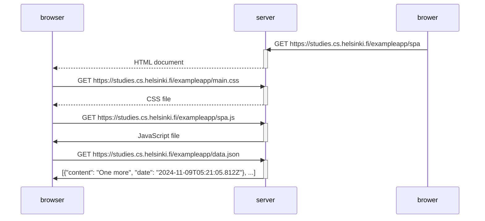

```mermaid
sequenceDiagram
    participant browser
    participant server

    brower ->> server: GET https://studies.cs.helsinki.fi/exampleapp/spa
    activate server
    server -->> browser: HTML document
    deactivate server
    
    browser ->> server: GET https://studies.cs.helsinki.fi/exampleapp/main.css
    activate server
    server -->> browser: CSS file
    deactivate server

    browser ->> server: GET https://studies.cs.helsinki.fi/exampleapp/spa.js
    activate server
    server ->> browser: JavaScript file
    deactivate server

    browser ->> server: GET https://studies.cs.helsinki.fi/exampleapp/data.json
    activate server
    server ->> browser: [{"content": "One more", "date": "2024-11-09T05:21:05.812Z"}, ...]
    deactivate server

```